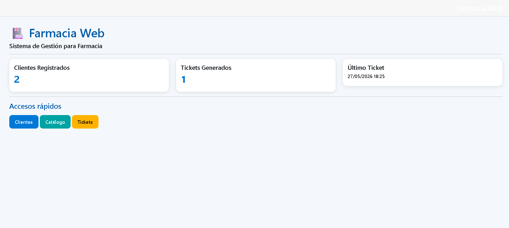
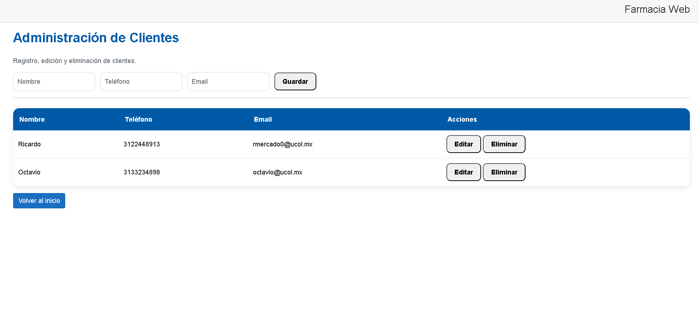
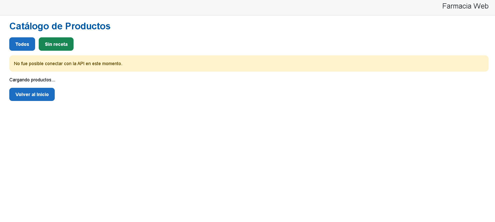
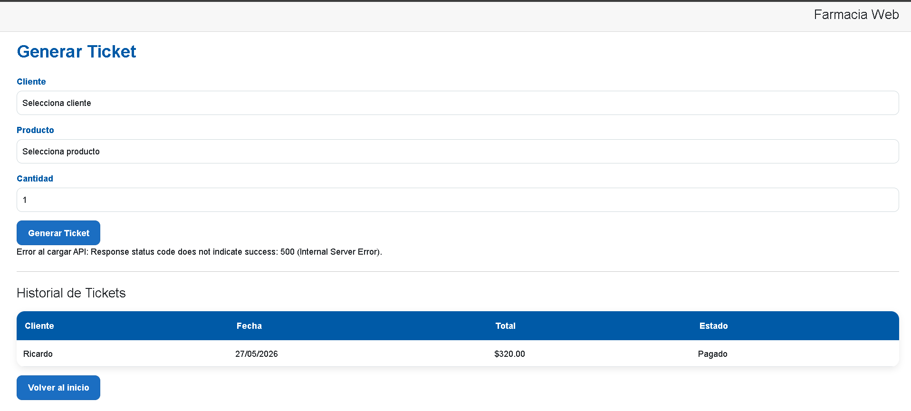

# Proyecto Final - Farmacia Web

## Alumno
Ricardo Mercado López

## Negocio asignado
Farmacia

## Descripción
Sistema web desarrollado con Blazor Server y Entity Framework Core para la gestión de una farmacia.

## Funcionalidades

- Página de inicio con resumen general.
- CRUD de clientes.
- Consulta de catálogo de productos mediante API externa.
- Generación de tickets de compra.
- Almacenamiento de información en Azure SQL Database.

## Tecnologías utilizadas

- C#
- Blazor Server (.NET 8)
- Entity Framework Core
- Azure SQL Database
- GitHub

## API utilizada

API Salud

Endpoint principal:

https://api-udec-pweb-aedec9hxbugye0am.westus3-01.azurewebsites.net/api/salud/productos

Endpoint sin receta:

https://api-udec-pweb-aedec9hxbugye0am.westus3-01.azurewebsites.net/api/salud/productos/sinreceta

## Capturas de pantalla

### Inicio

### Clientes

### Catálogo

### Tickets

